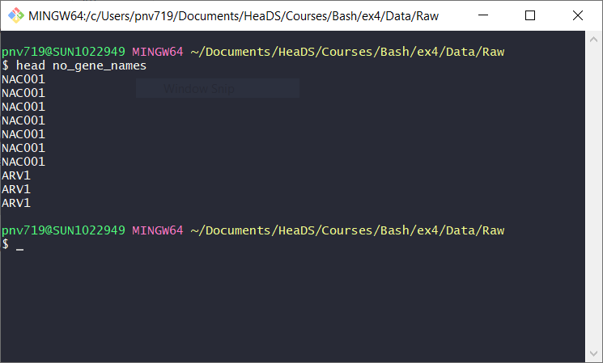

```{r setup, include=FALSE}
knitr::opts_chunk$set(echo = TRUE)
```

---

# Exercises

&nbsp;

## About this document

This markdown document contains the exercises for the introductory workshop on command line use, entitled `Just Bash It`. 

## Getting started

If you have not done so yet, download the materials from the github repo https://github.com/Center-for-Health-Data-Science/Just-Bash-It by selecting the green `Code` button on the top right and then `Download ZIP`. We suggest that you put it into your Documents folder so you can easily navigate to it with the terminal.

You also need to unzip the folder. On most systems this should be possible with right clicking on the folder and selecting `Extract` or something similar. 

### Windows

You should have installed git bash as detailed in the prep email. Open the terminal by writing 'git bash' into the windows search console and select the app. 

You should see something like this:


Go to where you have placed the unzipped git repo. If it is on your Documents you would do:

```{bash, engine="sh", eval=FALSE}
cd Documents
cd Just-Bash-It
```

You should see something like this:


Today we will work inside the workshop repo for the exercises and code-along. But you are of course free to explore the rest of your hard drive!

### Mac

Open the terminal with the launch pad (Cmd + space, then type terminal). 

Then navigate to where you have placed the unzipped git repo. If it is on your Documents you would do:

```{bash, engine="sh", eval=FALSE}
cd Documents
cd Just-Bash-It
```

It should look similar to the screenshot above in the Windows section, except that your terminal is probably white. 

Today we will work inside the workshop repo for the exercises and code-along. But you are of course free to explore the rest of your hard drive!

### Linux based systems

Open the terminal either via the launch pad or by holding Ctrl+Alt+t. 

Then navigate to where you have placed the unzipped git repo. If it is on your Documents you would do:

```{bash, engine="sh", eval=FALSE}
cd Documents
cd Just-Bash-It
```

It should look similar to the screenshot above in the Windows section.

Today we will work inside the workshop repo for the exercises and code-along. But you are of course free to explore the rest of your hard drive!

## A note on pseudo code

Some exercises and explanations in this document contain what is called 'pseudo code'. Pseudo code is an abstracted way to write an idea of code. It will not necessarily run when executed, so **do not copy** pseudo code straight into the command line. Rather it explains the idea of how your code should be structured. We will explicitly let you know when a snippet is ***pseudo code***. 

Pseudo code can look like this:

```{bash, engine="sh", eval=FALSE}
wc [your file]
```

In the above example square bracets mean you need to **replace** what is between them with the actual file, expression, ect you want to use. The square bracets themselves are not part of the code. For example, if you wanted to word count the readme file, you would replace `[your file]` with `README.md`:


```{bash, engine="sh", eval=FALSE}
wc README.md
```

---   

&nbsp;


## Getting help

There are different way of getting help:

* On Mac and Linux based systems, you can use `man [name_of_command]` to see a manual of the command. Not all commands have a manual. 

* On git bash (Windows), but also Mac and Linux, you can use `[name_of_command] --help` or `[name_of_command] -h` if the long option is not recognized. Not all commands have a help function.

* Googling the command or the error usually brings up good results

* You can also ask us during the exercise session, we are here to help you :).

There will be many error messages because things always go wrong and nobody knows or remembers how to do everything (including us!). It is very important that you apply step 1 of the error resolution procedure: **Don't Panic** (we might need a citation here :P). The computer will generally tell you if you're doing something it doesn't understand or that is wrong.


---   

&nbsp;


## Exercise 1: Navigating Files and Directories

1. List the contents of the top directory of the workshop, `Just-Bash-It`. You should see something like this:   

   

  * How many objects (files and directories) are there in the directory?   
  * Which ones are files and which are (sub) directories? How can you tell?

&nbsp;

2. Now, add the flag `-l` (that's the small letter L) to the `ls` command. What changes?

```{bash, engine="sh", eval=FALSE}
ls -l
```

Search the web to get an explanation of the output. What do the individual fields show?   
Use the help of ls `ls --help` (git bash) or `man ls` (on mac/linux) to answer the following questions:

  * Which file inside `Just-Bash-It` was last updated?
  * Which file in `Just-Bash-It` is the largest?
  * Are there any hidden files (that you normally don't see with a simple `ls`)?   
  
  If you cannot see the relevant infos like size and time stamp, use the `-l` option in combination with other options. 

&nbsp;

For the rest of this exercise we are going to work in the `Files` folder. 

3. Change directory to the `Files` folder and list its contents.

4. Now list the contents of the `Documents` folder without going into it.

5. Change directory into the `Documents` folder (inside the `Just-Bash-It` folder) and check what your current working directory is.

6. Change directory to the `Courses` folder. Are there any files inside? 

7. What is the full path of the file inside the `Courses` folder? 

8. From here, go to the `Pictures` folder (Hint: This folder should have been listed under point 3). Can you do it using the `../` syntax?

9. What is your current working directory? 

10. What is the relative path to the text file in the `Courses` folder from where you are right now? You can check your answer by using `ls [relative path to file]` and seeing whether it shows the file.   


---   

&nbsp;


## Exercise 2: File operations mv, cp and rm

0. If you are not there already, go to the `Pictures` folder under `Files`.

1. There is a file named `.txt` in the `Pictures` folder. It should not be there since it is not an image. Move the text file from the `Pictures` folder to the `Documents` folder. Confirm that it is in the right place and that it does not exist inside the `Pictures` folder anymore.

2. Make a copy of the `mytextfile.txt` file (should now be in `Documents`) and name the it whatever you'd like. 

3. Move one up to the `Files` directory and make a new folder here called `TEMP`. Now move the copied text file you created in point 2 to the `TEMP` folder. Confirm that it is in the right location.

4. Remove the whole `TEMP` directory including the file within it. Do you run into any problems with trying to do this?   
You need a flag to remove a whole folder. Try the help `rm --help` to figure out what flag this is.  


---   

&nbsp;


## Exercise 3: Project organization

Let's get structured!   

1. Make a `projects` directory where you would like it on your computer, for example on the Desktop or in your Documents.   
Inside the `projects` directory, create a directory for this course. You could name it i.e. **Just_Bash_It, Intro_to_command_line, First_Project, etc.**. Then inside that directory, create all the sub-directories shown on **slide 46** in the slideshow. 

2. Using the command-line, navigate back to where you have the course repo `Just-Bash-it`. Inside the `Files` directory there is a `Data` directory with the files we are going to use for the rest of the course. Move the compressed files (those with extension `.gz`) to the project directory you have made in **point 1** and place them in the correct sub-directory.

3. How large (in bytes and disk space) are the data files you moved from the course materials?

4. Check the permissions of the data files. Do you have permission to `read`, `write` and `execute` them? If you do not have permission to execute the files, what is the reason for this? 

5. Make a new file called `Readme.txt` inside the directory you made under point 1.


---   

&nbsp;


## Exercise 4: Viewing and editing files

1. Go to your project directory and edit the `Readme.txt` file you made in **Exercise 3** using the one of the editors `nano`, `vim or vi`, `emacs`. **N.B** you might only have one of them installed!   
A `readme` file should contain information about what a certain directory contains, its purpose and who owns it/is the editor.

2. Move to the sub-directory `Data/Raw` here you should have the four data files you moved from the course material directory.   

Two of these files are `fastq` files, they contain RNAseq reads from a bulk-RNA sequencing experiment using Arabidopsis thaliana (thale cress). The extension `_R1` and `_R2` denote that reads are paired-end (e.g. read 1 and read 2). The other two are `gff` files that contain gene annotations and other genomic features. We will first work with the file `GCF_genomicAnnotation.gff.gz` which contains info on the model organism Arabidopsis Thaliana.

3. Uncompress the `GCF_genomicAnnotation.gff.gz` annotation file while making sure you keep a copy of the compressed version.   
**HINT:** look into what flags/arguments need to be specified when decompressing). 

4. Try out the commands `less, cat, head, tail` on the expanded `.gff` file and study its content.   

You will notice that the file is made of two parts: A header part that contains information about the file and a data part that contains data in columns separated by whitespace. Lines that are part of the header start with a hash tag. The hash tag is generally the comment character, indicating that a line is not data.   

The data section of the file contains the fields (columns) shown below, and includes information on; annotation source, region, sequence start and end position, stand, as well as a column containing various information on the sequences, i.e. entry id, gene name, locus, ids, tags etc.  


    | NC ID       | Source   | Region   | Start    | End      | Strand  | Gene transcript etc. |
    | ------------|:--------:|:--------:|:--------:|:--------:|:-------:|---------------------:|
    | NC_003070.9 | RefSeq   | exon     | 4706     | 5095     | +       | gene=ARV1;locus_tag  |


5. Run the `head` command again on `GCF_genomicAnnotation.gff` and save the result into a new file called `gcf_head.txt`.  

6. Rename the expanded `.gff` to `Annotation.gff`. Move the `Annotation.gff` and `gcf_head.txt` to your `Scratch` directory.

7. **Without uncompressing the entire file**, have a look at the content of one of the two `fastq.gz` files that contain RNA sequencing reads. 


---   

&nbsp;


## Exercise 5: Data Wrangling 1

You will now test out some of the new commands introduced in the slide show and the command line presentation.   

Go to your directory `Scratch` where you should have a copy of the unzipped `GCF_genomicAnnotation.gff.gz` file named `Annotation.gff`, which you made in exercise 3.5 above. We will now do some data wrangling operations on the file. You can find all necessary commands on **slide 64** in the presentation (if they aren't named in the question). 

1. Figure out how many, lines, words and characters the `Annotation.gff` file contains using `wc`.

2. In Exercise 4 we established that the file is composed of a header part and a data part. We would like to remove the header, denoted by hash tags, for further processing and save the resulting file into a new file called `Annotation_tmp.gff` (so we still have `Annotation.gff` containing the header and the new file without it).   

We can do this in many ways but here we will chose to use the stream editor `sed` and omit the header lines by their line number.   

Have a look at the ***pseudo code*** below:
    
```{bash, engine="sh", eval=FALSE}
sed '[number first line],[number last line]d' Annotation.gff > Annotation_tmp.gff
```

You need to find the numbers and run the command. What do you think the `d` refers to?   

Have a look at the resulting `Annotation_tmp.gff` and verify whether it is correct. That means it should not contain any of the lines starting with a hash tag but all the other lines in `Annotation.gff`. If it is not correct try again until you have the correct file. 


3. For further analysis, we want to cut out only the columns describing the *Region*, *Start* and *Stop* of the genetic element. You will do this by using `cut` on `Annotation_tmp.gff` and redirecting the output into a new file called `GenomicRegion.tmp`.   

**HINT1:** First, identify the numbers of the columns we want.   
**HINT2:** A challenge is that the annotation file is separated by *tab* delimiter, which in unix is `\t`. To make `cut` accept it, we need to put`$` in front of it like so: `-d$'\t'` (there are no spaces here!). Don't ask, it's a long story... Check that your output file looks correct.   

Next, we would like to extract the gene names. They are in field/col 7 in the `Annotation_tmp.gff`, but field 7 contains itself several entries like ID, gene name, locus tags etc. separated by a `;`, i.e. field 7 contains sub-fields delimited by `;`.   

4. Extract the gene name by using `cut` twice. First, cut out column 7 from `Annotation_tmp.gff` and name that temporary file `col7.tmp`. Then, cut `col7.tmp` again to get the gene name and put it into `gene_names.txt`.   
**HINT:** We want the sub-field starting with `gene=` (this is where we find the genename).   


Check that your output file looks correct. It should look like this:   


5. We would now like to remove the `gene=` in each line to just obtain the clean **gene name** by itself. One way to get this is to do a search and replace with `sed `.   
The syntax is shown as ***pseudo code*** below.   
The `sed ` command requires you to specify what pattern to match `[pattern to match]` and what pattern to replace it with `[Replace with]`. The patterns are separated by slashes and the whole expression is encased in quotes `'`.   

**Note:** When using `sed` the input and output file cannot be the same, i.e. you cannot overwrite the input file in one command. But you could of course rename the output file to be the input file later with `mv`. 

```{bash, engine="sh", eval=FALSE}
sed 's/[pattern to match]/[Replace with]/g' [input file] > [output file]
```

For the pseudo code chunk figure out:   

  * What the input file should be?   
  * Change `[pattern to match]` to the pattern you want to match and `[Replace with]` to what you want to replace with (*HINT: replace with empty/nothing*).   
  * What does the `s` and `g` denote?   
  * Run the command and save the output to the a file and call it `gene_names_clean.txt`: .   
  Verify that your output looks correct, i.e. the `gene=` part is gone but the gene names are still complete. It should look like this:   
  
  


---   

&nbsp;


## Exercise 6: Data Wrangling 2

1. You should now have one file `GenomicRegion.tmp` containing only field 3, 4 & 5 from exercise 5.3 and one `gene_names_clean.txt` containing gene names from exercise 5.5.   

Paste these two files together into a single file using the command `paste`. Name this file `Annotation_Gene.gff`. The new file should be tab separated, just like the `GenomicRegion.tmp` file. To do so, use the delimiter flag to specify what kind of delimiter should be used to paste the fields together (tab is `\t`). 

2. Run and decipher the command below.

```{bash, engine="sh", eval=FALSE}
awk -F '\t' 'OFS="\t" {$5=$3-$2}{print}' Annotation_Gene.gff > Annotation_Gene_Len.gff
```


* What is the output of the command?   
* What does the flag `-F` specify?   
* What does `OFS="\t"` mean? _HINT: Google this!_   
* What is going on inside the curly brackets?   


3. Let's have a look at the content of your final file:   

  * Are there any gene sequences with length 0 in the annotation file? - Try the command `sort` with flags  `-k 5`, `-n` and `-t$'\t'` . Like `cut` `sort` needs some help with multi-field delimiters.   
  * What is the name of the gene with the longest sequence, annotated in your file? - Try the command `sort` with flags  `-k 5 -nr`.   
  * Does our organism of study, Arabidopsis Thaliana, have the `TERT` gene? - Try the command `grep`.   
  * All living organisms have polymerase genes (`POL` genes), check that Arabidopsis Thaliana also has one.
  * How many gene annotation lines in the file pertain to transfer RNA (`tRNA`)? Use `grep` and find the correct flag for counting.


&nbsp;          

4. Your new file `Annotation_Gene_Len.gff` does not have a header line explaining what the different columns are. Using an editor, i.e nano, make a new file called `header.gff` with these column names:   

```{bash, engine="sh", eval=FALSE}
Region    Start   End   GeneName    Length
```

The column headers should be separated by tab, just like the data columns.   
Now, use the command `cat` to put `header.gff` and `Annotation_Gene_Len.gff` together. Name the output `Annotation_[TodaysDate].gff`.   

When you have checked at the file looks correct, move the file to your **Results** directory - **N.B** go to the sub-directory and check that you have moved it correctly!. You can now remove (delete) all the temporary files in your `Scratch` directory. WELL DONE!


---   

&nbsp;


## Exercise 7: Redirection & Pipes

1. Copy (`cp`) the unzipped gff file for Arabidopsis Thaliana from your `Data/Raw` dir to the `Scratch` dir. It might be called `GCF_genomicAnnotation.gff` or `Annotation.gff` if you have renamed it in exercise 4. Then move to the `Scratch` directory.   

Lets try some piping (chaining) of commands.

2. Starting from the unzipped gff file we just copied,find out which types of genomic features (i.e. exon, rRNA, repeat) we have information on by chaining 4 commands together with the pipe operator `|`.   

<!-- When using a pipe, the output from the first command becomes the input to the second command. This enables us to do operations with less intermediate files. -->   

**Tip:** When testing chained commands you can be unsure what the outputs and inputs are at each pipe, or if a command has produced the expected output that you want to pass on. It is therefore a good idea to build the command step by step. You can execute step 1, check the output, then add step 2 and so forth until you have assembled your command. 

<!-- If you get tired of having the output fill up your screen you can always chain a `head` (i.e. `cut -f [colunm] [file] | head`) after the step to only see the first 10 lines of output. --> 
    
**The 4 steps** you need to perform are:   
  * Step 1: Remove the header rows (those beginning with hastages) in the file, like you did in point 2, Exercise 4, above.   
  * Step 2: Extract (`cut`) the column that contains the **Region**  (exon, CDS, etc.).   
  * Step 3: Sort the extracted column with `sort`.   
  * Step 4: Get the unique elements from this column with the command `uniq`.  

<br/>

3. Re-run the command line you used above, but this time redirect the output directly to the `Data/Generated` directory by specifying the path and the name you would like the output file to have. Check the `Data/Generated` directory to check that you have correctly made the file.


4. Using a single command line, figure out the gene name of the microRNA (miRNA) gene in `Annotation.gff` (NOT the new file you just made!) which has the smallest genomic starting coordinate.   

**HINT1:** You will need to combine commands `cut`, `sort` and `grep` (more than once if needed) to archive this. miRNA gene names begin with `MIR`.  
**HINT2:** Remember, you want to find the line describing the microRNA with the smallest genomic starting coordinate, but your final output should be the gene name, not the coordinate!  

5. Intermezzo: Working with your `history`.   

You have probably tried many commands in the last exercises and it can be difficult to remember what has worked or how exactly the syntax was. Luckily, all commands you have typed into your terminal are saved in the `history`!   

First, let's see how much is in your history. What does the below command tell you?

```{bash, engine="sh", eval=FALSE}
history | wc 
```

If you have a lot of commands saved in your history you might only want to see the last 20 or so. Can you show the last 20 commands using a pipe?

6. Finally, let's **redo points 2-5 from Exercise 5 and point 1 from Exercise 6**, starting from the `Annotation.gff` file, BUT this time using pipes to reduce the number of intermediate files. You should end up with a file containing these 4 columns: `Region, Start, End and gene name (only)`. Use your `history` if you can't remember the commands you used.   

There are many ways of achieving this. For those who like a challenge, it is possible to get to the final output file in two command lines (i.e. only one intermediate file).   
**HINT:** The commands do not need to be combined in the same order as in Exercise 5, in fact, they should not.
    

---   

&nbsp;


## Exercise 8: Part 1: Shell Scripts 

We will now save the commands from exercise 7.6 in a script so we don't lose them and can easily re-run our analysis with a different gff file. 

2. Create a new file, either directly on the commandline with `touch` or with the editor of your choice, and name it `ex8.sh`. This is the file which will contain your script.

2. Using your `history`, find the commands you used to solve exercise 7.6 and copy them into the file `ex8.sh`. Save the script. If you use `echo` for this, view the script file to verify that it looks as expected. 

3. Run `ex8.sh` by calling `bash`. Does it run without error? If not, correct what is wrong until it does. Check that it creates the correct files, i.e. they should look the same as when you manually executed the commands. 

```{bash, engine="sh", eval=FALSE}
bash -x ex8.sh
```

4. Add lines to your script `ex8.sh` that will remove the temporary files created. Check that these files are indeed removed, and no other files have been deleted by accident. If you did end up deleting something you still need can just re-download the respective file from github. 

5. Now replace the name of the input file, `GCF_genomicAnnotation.gff.gz`, with an argument so that you can run your script on different input files. In order to make this work we need to start from a **zipped file**, so we can apply this script to other gff files without having to manually unzip them first. So the first task is to find out how to unzip a gz file and redirect the output into a new file, so we will both leave the original file (i.e. `ecoli.gff.gz`) and control the name of the unzipped file. We do not want the unzipped file to be named `ecoli.gff` because then our script will only work on that particular file! To do this, look at the help for gzip and figure out which argument you need. A hint, we are trying to write to standard out and redirect that output into a file of our choice.


```{bash, engine="sh", eval=FALSE}
gunzip -h 
```

With this, write up a command that takes `ecoli.gff.gz` (or any other .gz file) and creates an unzipped file `unzipped.gff` while also leaving the original `ecoli.gff.gz` in place. This will be the first command in your new script script.

6. Run your script on `ecoli.gff.gz` by passing the file name as an argument. Test until it works. Remember to use `-x` to see the commands the script executes displayed. For debugging it helps to leave the temporary files so you can go back and check them, so you might want to command out the lines you added in 4. 


---   

&nbsp;


## Exercise 8: Part 2: Loops

1. Make a short script with a for loop that does the following: 

* Go to the data folder
* For each zipped file, i.e. each file ending with .gz:
    * display the file name
    * display the first 10 lines without unzipping the entire file. You could use the same solution as in Exercise 3.6, however that was likely the interactive viewing with `zless`. To get the first ten lines printed to stdout, you can instead use the unzipping command with a certain flag and pipe it to `head`.


---   

&nbsp;

## Exercise 9: Software Installation, Upkeep & More 

1. Try out the command below, what does it show you? What does `aux` specify?   
**HINT:** Remember you can use commands like `man` and `head` to help you understand what is going on.   
**N.B:** For Windows users git bash will only show you the processes related to running git bash itself, not so fun, but try the command anyways.

```{bash, engine="sh", eval=FALSE}
ps aux
```

2. Using the command `open` (OS X and Ubuntu) or `start` (gitbash) to launch a text editor (notepad, Notes, Evernote, etc.) and/or an internet browser (i.e. a Firefox, Safari, etc.) though the terminal.   
**HINT:** Make sure yo spell the application name correctly, i.e. capital letters, spaces, etc.


3. Now, kill the application you just opened. You will have to combine the commands `ps aux` and `grep` to get the `process id (pid)` for the application. What does the `-9` mean?


```{bash, engine="sh", eval=FALSE}
kill -9 [pid]
```


&nbsp;

You will now install and run a software thought the command line. The software we will be installed is [fastqc](https://www.bioinformatics.babraham.ac.uk/projects/fastqc/). This software is made for quality control of DNA/RNA sequencing data. The software produces a report with different statistics of read quality and bias checks.

The steps here are different for each operating system, and easiest for ubuntu/linux users:

&nbsp;

2. Install the  `fastqc` software: 

&nbsp;

**OS X (mac) Users:**   
First, Check if `homebrew` is installed:   
```{bash, engine="sh", eval=FALSE}
brew --version
```
**IF `homebrew` is not** installed then install it:   
```{bash, engine="sh", eval=FALSE}
/bin/bash -c "$(curl -fsSL https://raw.githubusercontent.com/Homebrew/install/HEAD/install.sh)"
```
**N.B** This may take a while.   
Check `homebrew` was installed correctly by running the `brew --version` as shown above.

Install `fastqc`
```{bash, engine="sh", eval=FALSE}
brew install fastqc
```

&nbsp;

**Ubuntu/Linux Users:**   
First, Check that `apt-get` is installed (it should be by default):   
```{bash, engine="sh", eval=FALSE}
apt-get --version
```

**IF `apt-get` is not** installed then install it:   
```{bash, engine="sh", eval=FALSE}
BLA
```
**N.B** This may take a while.   
Check `apt-get` was installed correctly by running the `apt-get --version` as shown above.

Install `fastqc`
```{bash, engine="sh", eval=FALSE}
BLA
```

&nbsp;

**Windows Users:**
BLA   

&nbsp;

We are now ready to run `fastqc`. In the `Data/Raw` folder you have two`fastq` files, they contain RNAseq reads from a bulk-RNA sequencing experiment using Arabidopsis thaliana (thale cress). The extension `_R1` and `_R2` denote that reads are paired-end (e.g. read 1 and read 2).

3. Move the two `fastq` files to your `Scratch` folder using one command line (i.e. both files at once).

4. Go to your `Scratch` folder and run `fastqc` on the files (both at once), you will have to google how.   
Importantly, send the output of `fastqc` (an html report) directly to the `Results` folder.   
**HINT:** Have a look at the `fastqc --help` to figure out which flag you will need.

5. Go to your `Results` folder and open the .html report produced by `fastqc`. You can do this using the command `open or start` (depending on your system),  name of your internet browser, followed by the name of the html report. See examples below.

OS X users:
```{bash, engine="sh", eval=FALSE}
# OS X (Mac) users:
open -a Firefox [report.html]
open -a "Google Chrome" [report.html]

# Ubuntu/Linum users:
BLA

# gitbash (Windows) users:
BLA

```

